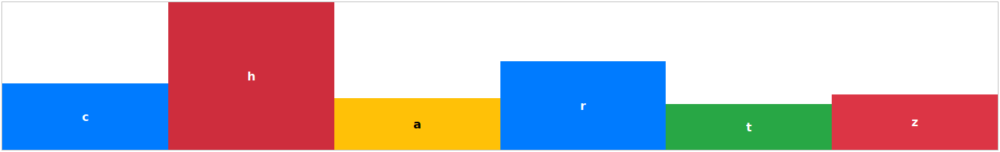
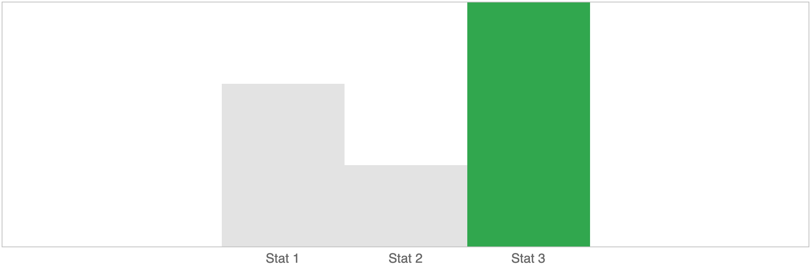

# Chartz

 




## Getting Started:
First you need to require the module in your bundled javascript file.
```js
const Chart = require('chartz');
```
Once the javascript is taken care of, you need to import the scss file.
```scss
@import('chartz/chartz')
```
Support for vanilla JS or CSS via `<script>` or `<link>` tags is not currently available, but that is part of the roadmap.

Initialize a new chart with:
```js
new Chart(elementId, options);
```
## Example:
The following options will give you this chart.

```js
let options = {
  items: [
    {
      height: 200,
      x: 'Stat 1'
	},
	{
	  height: 100,
	  x: 'Stat 2'
    },
    {
      height: 300,
	  x: 'Stat 3',
	  classes: ['success']
	}
  ],
  column: {
    maxWidth: 150
  },
  container: {
    width: 75
  }
}
```

## Options
The bare necessities for the options is this:
```js
let options = {
  items: [{
    name: <string>,
    height: <int>
  }]
}
```
```js
let options = {
  items: [],
  type: <string>, /* Defaults to 'bar-vertical' */
  container: {
    height: <string>, /* Optional | Passed exactly as given */
    width: <int> /* Optional | Passed as percentage */
  },
  column: {
    maxWidth: <int>, /* Optional | Passed as px */
    axisPosition: <string> /* Optional | Default is bottom, can also choose top */
  }
}
```

## Chart Types:
There are many types on the roadmap, but for now there is only one – `bar-vertical`. Please let me know what charts you would find most useful.


## Item Interface
```js
let item = {
  name: <string>, /* Optional | Displayed inside of the bars */
  height: <int>,
  classes: <array of strings>, /* Optional */
  x: <string> /* Optional | Will be displayed outside of the chart on either the top or bottom */
}
```

### Additional Options
By default you can add any of the following classes to an item to achieve similar styling to Bootstrap's associated colors.
`success`  `danger`  `info` `secondary` `warning`  `secondary`
