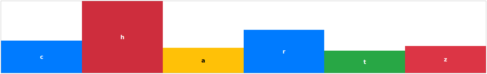

# Chartz



### Getting Started:
Initialize a new chart with:
```javascript
new Chart(elementId, options);
```
The bare necessities for the options is this:
```javascript
{
  items: [{
        name: <string>,
        height: <int>
    }]
}
```


### Options
```javascript
{
    items: [],
    type: <string>, /* Defaults to 'bar-vertical' */
    container: {
        height: <string>, /* Optional | Passed exactly as given */
        width: <int> /* Optional | Passed as percentage */
    },
    column: {
        maxWidth: <int> /* Optional | Passed as px */
    }
}
```


### Item Interface
```javascript
{
    name: <string>,
    height: <int>,
    classes: <array of strings> /* Optional */
}
```
